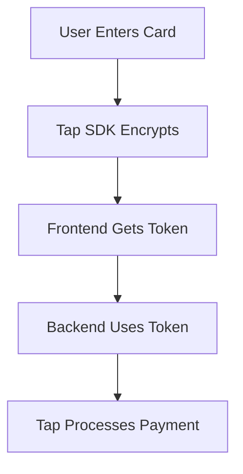

# Payment Security Update: Standardized Encrypted Token Flow

## Overview

This document outlines the security improvements made to the payment system by standardizing all payment flows to use encrypted tokens instead of plain card details.

## Changes Made

### ❌ Before (Security Issue)
- **Direct Payment Flow**: Sent plain card details from frontend to backend
- **Regular Payment Flows**: Used encrypted tokens from Tap SDK
- **Inconsistent security**: Mixed approaches across different payment methods

### ✅ After (Secure & Consistent)
- **All Payment Flows**: Now use encrypted tokens from Tap SDK
- **No Plain Card Data**: Card details never leave the browser unencrypted
- **Consistent Security**: Same secure approach across all payment methods

## Technical Changes

### 1. Backend API Updates

#### `src/app/api/customer/direct-payment/route.ts`
- **Removed**: `createTapToken` (plain card tokenization)
- **Updated**: Now accepts `tokenId` instead of `cardData`
- **Simplified**: Uses pre-encrypted tokens from frontend

```typescript
// OLD - Insecure
const body = await request.json() as {
  cardData: CardData;  // Plain card details 🚨
  // ...
};

// NEW - Secure
const body = await request.json() as {
  tokenId: string;     // Encrypted token ✅
  // ...
};
```

#### `src/lib/utils/tapPaymentUtils.ts`
- **Enhanced**: Better error handling for token issues
- **Validated**: Ensures TAP_SECRET_KEY is configured
- **Improved**: More specific error messages for debugging

### 2. Frontend Component Updates

#### `src/components/CardPaymentForm.tsx`
- **Replaced**: Custom card form with `TapCardForm` component
- **Removed**: Plain card data collection and validation
- **Added**: Secure token handling from Tap SDK

```typescript
// OLD - Collected plain card details
const [cardData, setCardData] = useState<CardData>({
  number: '', expiryMonth: '', // ... 🚨
});

// NEW - Uses encrypted tokens
const handleTokenReceived = (token: string) => {
  processPayment(token); // ✅
};
```

### 3. Security Improvements

#### PCI DSS Compliance
- **Card Data**: Never stored or transmitted in plain text
- **Tokenization**: Handled by Tap SDK in browser
- **Encryption**: All card data encrypted before leaving user's device

#### Consistent Token Flow


## Environment Configuration

### Required Environment Variables

```bash
# .env file
TAP_SECRET_KEY=sk_test_your_secret_key_here
NEXT_PUBLIC_TAP_PUBLIC_KEY=pk_test_your_public_key_here
NEXT_PUBLIC_TAP_MERCHANT_ID=your_merchant_id_here
```

### Configuration Validation

The system now validates TAP configuration and provides clear error messages:

```typescript
if (!process.env.TAP_SECRET_KEY) {
  return NextResponse.json(
    { error: 'Payment system is temporarily unavailable. Please contact support.' },
    { status: 500 }
  );
}
```

## Error Handling Improvements

### Better User Messages
- **Configuration Issues**: "Payment system is temporarily unavailable"
- **Authorization Failures**: "Payment authorization failed. Please contact support"
- **Card Declined**: "Payment was declined. Please check your card details"

### Enhanced Logging
- **Detailed Errors**: Full error context for debugging
- **Status Tracking**: Clear payment status flow
- **Token Validation**: Proper token creation verification

## Benefits

### 🔒 Security
- **No Plain Card Data**: Eliminates PCI compliance risks
- **Encrypted Tokens**: All card data encrypted by Tap SDK
- **Consistent Security**: Same secure flow everywhere

### 🛠️ Reliability
- **Better Error Handling**: More informative error messages
- **Configuration Validation**: Clear setup requirements
- **Consistent Flow**: Single payment approach reduces bugs

### 🚀 Performance
- **Simplified Backend**: Less card data processing
- **Frontend Efficiency**: Leverages Tap SDK optimizations
- **Reduced Complexity**: Single token flow to maintain

## Testing

### Test Configuration
1. Set up proper environment variables
2. Use Tap test keys for development
3. Verify token creation in browser console

### Test Flow
1. Enter card details in TapCardForm
2. Verify token generation (check network tab)
3. Confirm payment processing with encrypted token
4. Validate payment record creation

## Migration Notes

### For Developers
- **No Breaking Changes**: Existing payment flows unchanged
- **Enhanced Security**: Direct payments now use same secure flow
- **Better Error Messages**: Easier debugging and user support

### For Users
- **Same Experience**: Payment UI remains familiar
- **Better Security**: Card data better protected
- **Clearer Errors**: More helpful error messages

## Troubleshooting

### Common Issues

#### "Payment system is temporarily unavailable"
- **Cause**: TAP_SECRET_KEY not configured
- **Solution**: Set proper environment variable

#### "Payment authorization failed"
- **Cause**: Invalid TAP credentials
- **Solution**: Verify TAP_SECRET_KEY is correct

#### "Failed to load Tap Card SDK"
- **Cause**: Network issues or incorrect public key
- **Solution**: Check NEXT_PUBLIC_TAP_PUBLIC_KEY and network

## Future Improvements

### Planned Enhancements
- [ ] Add card brand detection from tokens
- [ ] Implement saved card tokenization
- [ ] Add payment method preferences
- [ ] Enhanced fraud detection integration

### Monitoring
- [ ] Payment success rate tracking
- [ ] Token generation failure monitoring
- [ ] Error pattern analysis
- [ ] Performance metrics collection

---

**Security Note**: This update significantly improves payment security by ensuring all card data is encrypted before transmission and never stored in plain text on our servers.