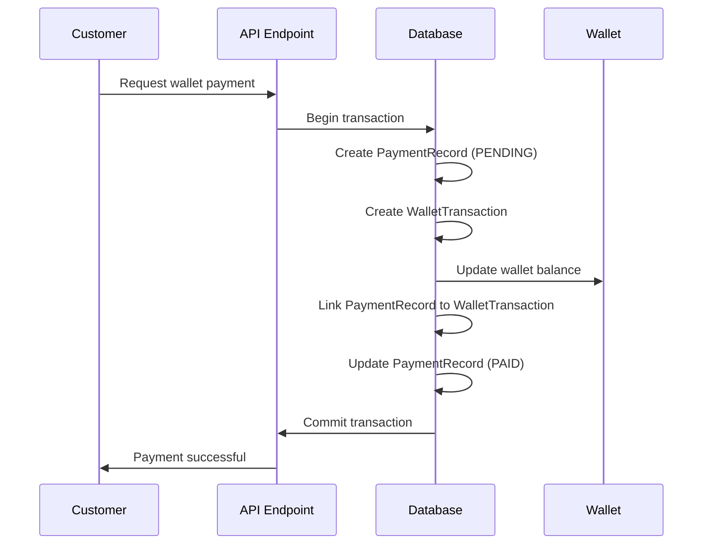

# Wallet Transaction Management

## Overview
This document outlines the improved wallet transaction management system that ensures proper data integrity and audit trails for all wallet operations.

## Key Improvements Made

### 1. Atomic Database Transactions
All wallet operations now use Prisma database transactions to ensure atomicity:

```typescript
// Before: Separate operations (could fail partially)
const transaction = await prisma.walletTransaction.create({...});
await prisma.wallet.update({...}); // Could fail, leaving inconsistent state

// After: Atomic operations
const result = await prisma.$transaction(async (tx) => {
  const transaction = await tx.walletTransaction.create({...});
  await tx.wallet.update({...});
  return transaction;
});
```

### 2. Enhanced Payment Processing
The `processWalletPayment` function now ensures complete atomicity:

- ✅ Creates payment record (PENDING status)
- ✅ Creates wallet transaction with proper balance tracking
- ✅ Updates wallet balance
- ✅ Links payment record to wallet transaction
- ✅ Marks payment as PAID
- ✅ All operations succeed or fail together

### 3. Proper Balance Tracking
Every wallet transaction includes:
- `balanceBefore`: Wallet balance before the transaction
- `balanceAfter`: Wallet balance after the transaction
- `amount`: Transaction amount
- `transactionType`: Type of transaction (PAYMENT, DEPOSIT, etc.)
- `status`: Transaction status (PENDING, COMPLETED, FAILED)

### 4. Transaction Linking
Payment records are properly linked to wallet transactions:
- `PaymentRecord.walletTransactionId` → `WalletTransaction.id`
- `WalletTransaction.metadata` contains `paymentRecordId`
- Bi-directional relationship for complete audit trail

### 5. Integrity Verification
Added `verifyWalletTransactionIntegrity()` function that:
- Validates balance calculations across all transactions
- Checks for missing or orphaned records
- Ensures proper transaction sequencing
- Reports any data inconsistencies

## Database Schema Relationships

```
Customer (1) ←→ (1) Wallet
Wallet (1) ←→ (many) WalletTransaction
Customer (1) ←→ (many) PaymentRecord
PaymentRecord (many) ←→ (1) WalletTransaction [optional link]
```

## Transaction Flow for Wallet Payments



## Error Handling

### Insufficient Balance
```typescript
if (wallet.balance < amount) {
  throw new Error('Insufficient wallet balance');
}
```

### Transaction Rollback
If any step fails, the entire transaction is rolled back:
- No partial payments
- No orphaned records
- Wallet balance remains unchanged
- Payment record is not created

### Integrity Checks
Regular integrity verification can detect:
- Balance calculation errors
- Missing transaction records
- Inconsistent wallet states

## API Endpoints

### Wallet Payment
- **Endpoint**: `/api/customer/manual-payment`
- **Method**: POST
- **Uses**: `processWalletPayment()` function
- **Ensures**: Atomic wallet transaction processing

### Wallet Information
- **Endpoint**: `/api/customer/wallet-info`
- **Method**: GET
- **Returns**: Current balance and recent transactions
- **Uses**: `getWalletInfo()` function

### Direct Card Payment
- **Endpoint**: `/api/customer/direct-payment`
- **Method**: POST
- **Creates**: Payment record without wallet transaction
- **Separate**: From wallet transaction flow

## Best Practices Implemented

1. **Always use database transactions** for multi-step wallet operations
2. **Validate wallet balance** before processing payments
3. **Track balance changes** with before/after values
4. **Link related records** for complete audit trail
5. **Handle errors gracefully** with proper rollback
6. **Verify data integrity** regularly
7. **Use proper transaction types** for different operations

## Migration Considerations

- ✅ All existing wallet functionality preserved
- ✅ No breaking changes to existing APIs
- ✅ Enhanced error handling and data integrity
- ✅ Backward compatible with existing payment records
- ✅ New integrity verification available for existing data

This enhanced wallet transaction management ensures that all wallet operations maintain data consistency and provide complete audit trails for financial transactions.